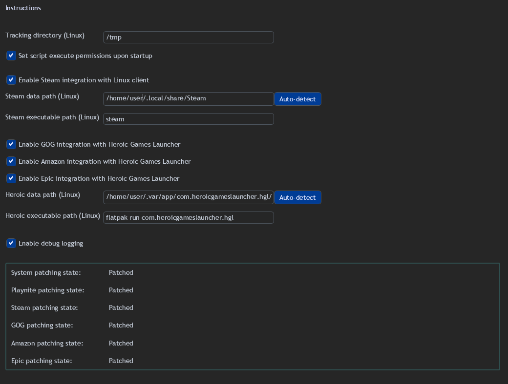

# Playnite Wine Bridge Plugin

This plugin allows you to integrate [Playnite](https://playnite.link/) running under Wine on Linux with native
applications. It allows you to detect currently installed games, install, uninstall and launch Steam games the same way
it works on Windows. Also, it gives you the ability to configure any Linux game to be launched from Playnite.

How does it work? It uses [Harmony](https://harmony.pardeike.net/) to patch specific methods in Playnite and Steam
Library plugin to redirect them to a custom script that allows you to launch and track any process on Linux.

## Motivation

After I moved my primary gaming PC to Linux, I've experimented with running Playnite under Wine and finally have managed
to get it working with my existing library of games. As expected, many things such as game installation and launching
were not working at all. After some research, I've managed to create scripts that allow me to run native terminal
commands from Playnite, which in turn allows me to launch any game regardless of how it was installed. The problem being
that it quickly became cumbersome to write custom play actions for every game I wanted to launch. And thus, this plugin
was created.

## Information

The plugin currently supports:

- installation, uninstallation and launching of Steam games
- option to add custom play actions for any game

## Planned features

- support for GOG, Amazon and Epic games through Heroic Games Launcher
- option to easily add custom play actions for Steam, Heroic and Lutris games

## Instructions

### Basic configuration

1. Install [Playnite](https://playnite.link/) inside a [Wine Prefix](https://www.winehq.org/) on your Linux machine.
   This
   isn't a tutorial for that, but here's some general tips: use Wine 9 or above, install `corefonts dotnet48` inside
   the prefix using `winetricks` and once the app is installed disable the following option: Settings > Advanced >
   Disable hardware
   acceleration.
2. Install any library extensions you want to use with Playnite. Install this plugin from the official Playnite
   extension repository.
3. Make sure the Linux script has execution permissions. The script is located in the plugin directory within the
   Resources folder. Command to set the needed permission:

```shell
   chmod a+x <wine_prefix_path>/drive_c/users/<user>/AppData/Roaming/Playnite/Extensions/Yalgrin_WineBridgePlugin/Resources/run-in-linux.sh
```

4. Configure the plugin in Playnite settings as follows:



_A lot of these paths are using the default Wine drive mappings, meaning the root folder `/` is mapped to a `Z:` drive. If you decide to change those you have to adjust the following parameters accordingly._

- **Tracking directory (Wine)** and **Tracking directory (Linux)** - these directories will be used to detect the running processes launched from Playnite. Make sure they point to the same directory. By default, they point to `/tmp` folder. You can safely leave them as they are.
- If you want to use Steam integration, check the **Enable Steam integration** option and configure the following parameters:
  - **Steam installation path (Wine)** - path to the Steam data folder, meaning the folder containing (among others) `steamapps` and `userdata` directories.
  - **Steam executable path (Linux)** - path to the `steam` executable in your Linux system.
  - _If you have installed the Steam client natively on your Linux machine, all you likely need to do is to change the `user` folder to your actual username. If you use Steam client installed as a Flatpak, the params should look more or less like this:_
    - **_Steam installation path (Wine)_** - `Z:\home\<user>\.var\app\com.valvesoftware.Steam\.local\share\Steam`
    - **_Steam executable path (Linux)_** - `flatpak run com.valvesoftware.Steam`
- If something doesn't work quite right, before reporting the issue, enable the **Enable debug logging** option and repeat the action. Include the `extensions.log` and `/tmp/wine-bridge.log` files in the report.

5. Restart Playnite. Go back to the settings and make sure that System and Playnite patching states are displayed as "Patched". If you use the Steam integration plugin as well, then Steam patching state should also be displayed as "Patched".

### Custom play actions

If you want to run other games from Playnite, you can add them as custom play actions by right clicking on the desired game and going to the **Wine Bridge** menu.

Before you do anything, make sure you know the terminal command that will launch the game. Run the command in the terminal and determine whether it waits for the game to close or not.

If the command waits for the game to close, follow the **Synchronous commands** section. If not, use the **Asynchronous commands** section.

#### Synchronous

1. Right click on the game and go to the **Wine Bridge** menu.
2. Select **Add custom Linux action**.
3. Enter the terminal command you've previously used to launch the game and confirm it with **OK**.
4. Enter the custom name for the play action (or leave it at default) and confirm it with **OK**.
5. The game should be marked as installed and you should be able to launch it from Playnite.

For example:
- if I want to launch **Space Cadet Pinball** installed as a Flatpak, I would use the following command: `flatpak run com.github.k4zmu2a.spacecadetpinball`

#### Asynchronous

1. Determine the **tracking expression** for the game you want to launch. The script uses `pgrep` to find the exact process(es) it needs to track, so you want to the same format. One way to do it is to run the following commands:
```shell
   ps -aux
```
and manually search for the process name. Use `grep` to narrow down the results.
```shell
   ps -aux | grep "<search term>"
```
Make sure the the search term finds only the game and not any other processes. Once you're done, write down the final expression.

2. Right click on the game and go to the **Wine Bridge** menu.
3. Select **Add custom async Linux action**.
4. Enter the terminal command you've previously used to launch the game and confirm it with **OK**.
5. Enter the found tracking expression and confirm it with **OK**.
6. Enter the custom name for the play action (or leave it at default) and confirm it with **OK**.
7. The game should be marked as installed and you should be able to launch it from Playnite.

For example:
- if I want to launch **Guild Wars 2** installed using Heroic Games Launcher as a custom game, I would use the following command and tracking expression:
  - command - `xdg-open 'heroic://launch?appName=pPo838krjLRRDrJWvtPm3M&runner=sideload'` which I obtained by creating a shortcut through Heroic and getting the command from the properties of the shortcut.
  - tracking expression - `Gw2-64.exe` since it spawns a process with the name of this file in the name. You can probably use something more precise just to be sure.

## Potential issues

#### The game never gets past the "Launching" state or displays an error regarding something in Wine

Likely caused by invalid configuration or missing permissions. Make sure you've followed the instructions carefully and that you've set the correct paths. You can also enable debug logging and check the logs.

#### The game launches but Playnite treats about it as if it closed immediately

This is most likely caused by invalid tracking expression. Launch the game and manually find it using `ps -aux | grep "<search term>"` command. If it returns nothing, then you will need to adjust the tracking expression.

#### The game launched but it is stuck on the "Playing" state

This is most likely caused by invalid tracking expression. Launch the game and manually find it using `ps -aux | grep "<search term>"` command. If it returns anything other than the game process, then you will need to adjust the tracking expression.

## Donate

If you like what I do, feel free to buy me a coffee.

[](https://ko-fi.com/yalgrin)

## Credits

- [Playnite](https://playnite.link/) by [JosefNemec](https://github.com/JosefNemec)
- [Harmony](https://harmony.pardeike.net/) by [Pardeike](https://github.com/pardeike)
- [Wine project](https://www.winehq.org/)
- [Wine icons created by Freepik - Flaticon](https://www.flaticon.com/free-icons/wine)
